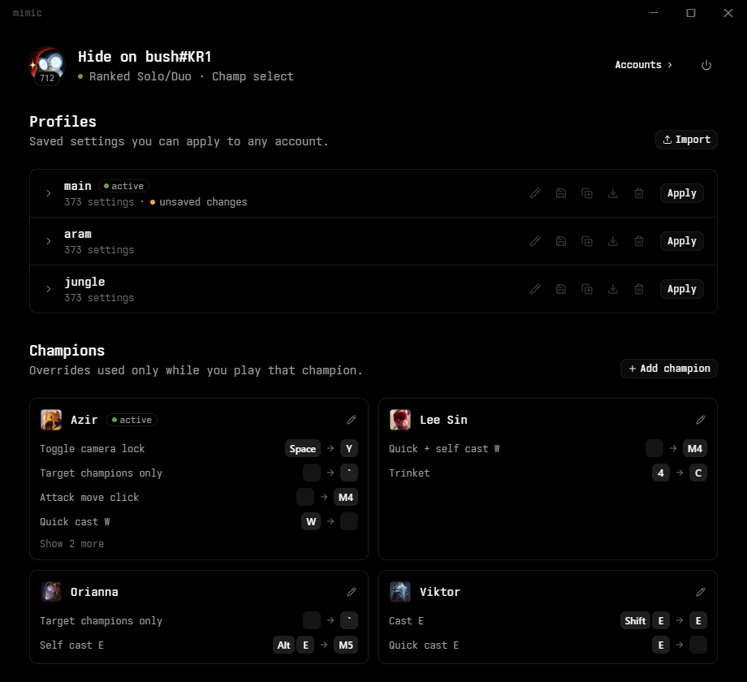
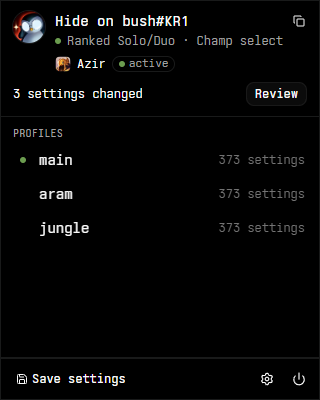
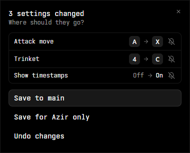

<p align="center">
  
</p>
<h1 align="center">mimic</h1>
<p align="center">
  Your League of Legends settings, on every account and for every champion.
</p>
<p align="center">
  <a href="https://github.com/nikhilsidhu/mimic/releases/latest"></a>
  <a href="https://github.com/nikhilsidhu/mimic/releases"></a>
  <a href="LICENSE"></a>
</p>

mimic is a Windows tray app that saves your League settings as profiles and applies them for you:

- **Across accounts.** Keybinds, camera, HUD and sound settings follow you when you log into another account. An account can apply its profile by itself at every login.
- **Per champion.** A champion can have its own overrides. They go on when you pick the champion and come off after the game.

You keep changing settings in the game itself. After a game mimic shows what changed and asks where it should go: into your profile, to that champion only, or undone.

<p align="center">
  
</p>

## Download

**[Download mimic for Windows](https://github.com/nikhilsidhu/mimic/releases/latest/download/mimic-setup.exe)** (Windows 10 and 11)

Run the installer; it needs no administrator rights. It is not code-signed yet, so Windows shows "Windows protected your PC": choose **More info**, then **Run anyway**. After that, mimic finds new versions by itself and installs them when you ask it to in Settings.

Older versions and release notes are on the [releases page](https://github.com/nikhilsidhu/mimic/releases).

## Getting started

1. Log into League on the account whose settings you like.
2. Click mimic's tray icon and save the current settings as a profile.
3. Log into another account and apply the profile. The settings take effect in your next game.

mimic is new, so if something looks off, please [open an issue](https://github.com/nikhilsidhu/mimic/issues).

## What it does

- Saves the logged-in account's settings as a profile, applies a profile to any account, and keeps a snapshot before every change so it can be undone.
- Shows a change log of exactly which settings each change altered, with keybinds drawn as keys.
- Notices when Riot resets your settings after a patch and offers to put yours back.
- Exports and imports profiles as single files.
- Lets you mute settings you flip with hotkeys, like the FPS counter, so it stops asking about them.
- Black, dark and light themes.
- Lives in the tray. One panel for everyday use, a manager window for the rest.

<table align="center">
  <tr>
    <td valign="top"></td>
    <td valign="top"></td>
  </tr>
  <tr>
    <td align="center"><sub>The tray panel</sub></td>
    <td align="center"><sub>After a game</sub></td>
  </tr>
</table>

## Questions

**Is this allowed?**
mimic only talks to the League client's local API and reads config files. It never reads or modifies the game process and automates nothing in champ select or in game. mimic is not endorsed by Riot, and nobody but Riot can promise what Riot allows.

**Why not just copy the config files?**
League stores your in-game settings per account on Riot's servers and downloads them at login, so copied files are overwritten. mimic writes settings through the client while you are logged in, and the client syncs them to the account.

**Where is my data?**
In `%APPDATA%\mimic`, as plain JSON. There is no account, no server and no telemetry. Champion names and icons are fetched from your own League client and cached; none of Riot's assets ship with mimic.

## Reporting a problem

Open an [issue](https://github.com/nikhilsidhu/mimic/issues) and say what you did and what happened. Logs help a lot: in the manager, Settings > Data opens mimic's folder, and the logs are in `logs`. They contain your Riot ID, so look before you post.

## Development

Requirements: Windows, [Rust](https://rustup.rs) (MSVC toolchain), Visual Studio Build Tools 2022 with "Desktop development with C++", and Node.js LTS. Use a native Windows shell, not WSL.

```powershell
npm install
npm run tauri dev                 # run the app
npm run check                     # type-check the frontend
cargo test --manifest-path src-tauri/Cargo.toml --lib
npm run tauri build               # build the installer
```

`cargo run --example lcu_log` in `src-tauri` logs the client events mimic depends on, for measuring their timing across real games. `scripts/capture-windows.ps1` screenshots mimic's windows.

Pushing a tag like `v0.1.0` builds a signed installer and attaches it to a draft release. Publishing the draft is what ships the update.

## Code signing policy

Releases are built by GitHub Actions from the tagged source. mimic's auto-updater accepts only builds signed with mimic's own update key.

- Author, reviewer and approver of releases: Nikhil Sidhu ([@nikhilsidhu](https://github.com/nikhilsidhu)).

This program will not transfer any information to other networked systems unless specifically requested by the user. Its only network requests are to the League client on your own PC and to GitHub, to see whether a newer version exists; the update check can be run by hand from Settings, and it sends nothing about you.

## Legal

mimic isn't endorsed by Riot Games and doesn't reflect the views or opinions of Riot Games or anyone officially involved in producing or managing Riot Games properties. Riot Games, and all associated properties are trademarks or registered trademarks of Riot Games, Inc.

Licensed under the [MIT License](LICENSE). The bundled font, Ioskeley Mono, is under the [SIL Open Font License](src/lib/fonts/ioskeley-mono/OFL.txt).
